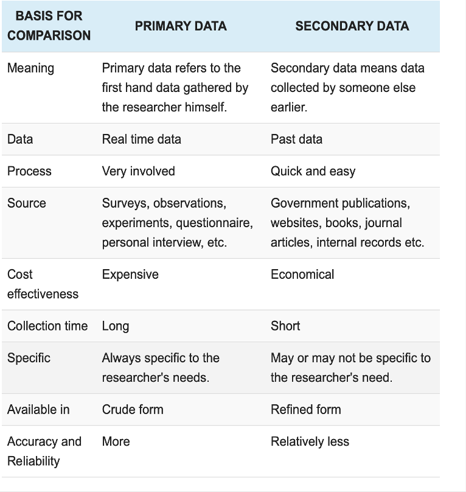

There are three main sources of data: primary, secondary, and supplementary. Primary data refers to data that is collected first-hand. Secondary data is collected by someone other than the researcher themselves. Secondary data is collected for a purpose distinct from one’s own research topic, but can be useful as evidence or additional information. Secondary data is usually made available by public agencies of statistics, non-governmental organizations (NGOs) or research centers. Secondary data can also be extracted from websites and social networks for marketing research. Supplementary data is secondary data that is made available to the public via academic journals. Supplementary data is often government-funded and generally published as supplementary materials in journals. These datasets can be downloaded and used for one’s own research or to reproduce studies in order to determine whether the findings are reliable; reproducing studies is important for verifying the results of scientific research. 


```{r, echo=FALSE, out.width="50%", fig.cap="Primary vs Secondary sources of data",fig.align='center'}

```

# Example of secondary data extraction, manipulation and visualization
## Extracting Data Online

Here is an example of how we can use the R package to harvest data and the dygraph package to visualize that data. The data we aim to extract contains 3 variables: population growth, natural increase, and migration growth in Canada from 1987 to 2017. We are going to extract an `mts` object for _mutiple time series_.We can access the data using the [Statistic Canada website](https://www150.statcan.gc.ca/n1/pub/12-581-x/2018000/pop-fra.htm). 

```{r message=FALSE, warning=FALSE}
#Installation of the rvest package
if (!require('rvest')) {
  install.packages("rvest")
}
#Extraction from the website of statistics Canada
url <- "https://www150.statcan.gc.ca/n1/pub/12-581-x/2018000/pop-fra.htm"
doc <- read_html(url)
tables <- html_table(doc, fill = TRUE) #To extract different tables from the website
#Visualize the object tables (here tables is a list) to see which one is targeted.
#In this case it is the table number 3.
demo<- tables[[3]]

#We delete the first and last rows. We don't need it.
demo <- demo[-c(1,nrow(demo)),]

```

## Data manipulation

Sometimes, there is a need to change the data into the desired format.
In this, case we have to change the data from character to numeric values as in `R`, decimal values are specified with a dot (.) and not a comma (,). To show the evolution with a graphic, we also have to change the data into temporal series.

```{r message=FALSE, warning=FALSE}
#Intallation of the wts package
if (!require('xts')) {
  install.packages("xts")
}
#We replace each comma by a dot.
demo.graph <- data.frame(sapply(demo,function(x) gsub(",", ".", gsub("\\.", "",x))))
#We convert the dataframe into a time series object.
demo.graph <- xts(demo.graph[,-1],order.by=as.Date(demo.graph[,1], "%Y"))
```


Here are the first six observations of the database: 

```{r echo=TRUE, message=FALSE, warning=FALSE}
library(kableExtra)
kable(head(demo.graph)) %>%
  kable_styling(bootstrap_options = "striped", font_size = 12)
```

As you can see, column names are in french. We can simply rename columns using:

```{r}
colnames(demo.graph)<-c("population growth", "natural increase", "migration growth")
```

## Data visualization with the `dygraphs` package

Made available in 2009, `dygraphs` was initially developed by Google with the JavaScript language for its own internal needs before making it public. Since then, `dygraphs` has been used in many organizations such as NASA, Wikimedia or even GhanaStocks. The `dygraphs` package essentially allows production of interactive graphs of time series data. It is also possible to produce non-interactive graphs. The introduction of this graphics library in 2014, in the `R` software, makes the best of `dygraphs` accessible to `R` users. The version in `R` makes it possible to use many of the functions of the `dygraphs` library in JavaScript. A very simple way to create a graph with the `dygraphs` package is to use the function of the same name `dygraph`. It has the same arguments as the basic R graph function: `plot`. The `data` argument is used to specify the data set. The arguments `ylab` and `xlab` are used to specify the names of the axes. We can add the title with the `main` argument. To shorten the code, we can initialize an object of class `dygraphs`. Placing the cursor on the curves allows to display the data by point.

```{r}
#Installation du package dygraphs
if (!require('dygraphs')) {
  install.packages("dygraphs")
}
```


```{r message=FALSE, warning=FALSE, fig.width=8}
d <- dygraph(data = demo.graph, 
        main = "Demographic growth in Canada", 
        ylab = "Number of indidivuals (thousands)", 
        xlab = "Years") %>% 
      dyLegend(width = 500,labelsSeparateLines =TRUE)%>%
      dyAxis(name = "x",axisLabelColor = "blue", axisLabelFontSize = 10,drawGrid = FALSE) %>%
      dyAxis(name = "y",axisLabelColor = "blue",axisLabelFontSize = 10,gridLineWidth = 0.1)
d
```


# Here are examples of useful secondary-data sources. For a more extensive list please see: [Secondary data sources](https://researchguides.ben.edu/c.php?g=282050&p=7037030)

[Afrobarometers](https://afrobarometer.org/)

Afrobarometer is a non-partisan, pan-African research institution that conducts public-attitude surveys on democracy, governance, the economy and society in 30+ countries. Their surveys are repeated on a regular cycle. Afrobarometer is a useful source of data on what Africans are thinking.

[World development indicators](https://databank.worldbank.org/source/world-development-indicators)

World Development Indicators (WDI) compiles data pertaining to development indicators from officially-recognized international sources. 

[Multiple Indictor Cluster Survey (MICS)](http://www.unicef.org/statistics/index_24302.html)

UNICEF regularly conducts international household surveys pertaining to the situation of women and children in 115 countries. This data is made freely available to the public. 

[OpenWeatherMap](https://openweathermap.org/)

OpenWeatherMap provides access to current weather, forecasts, maps and historical data. 

[Demographic and Health Surveys (DHS)](http://dhsprogram.com/)

The Demographic and Health Surveys (DHS) Program collects, analyzes and disseminates data pertaining to population, health, HIV, and nutrition in over 90 countries.


We hope this description was useful, do not hesitate to comment.

LSTP-Statistics&Coding